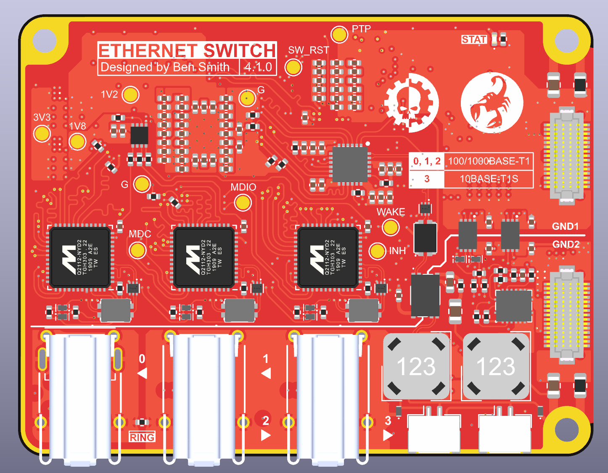

# Switch v4 Hardware

KiCad design files for the 4th iteration of my single pair Ethernet (SPE) switch. The firmware can be found in [switch-v4-firmware](https://github.com/ben5049/switch-v4-firmware).

Also see my post on [r/embedded](https://www.reddit.com/r/embedded/comments/1mxale6/i_built_a_single_pair_ethernet_switch/)!

## Design

See the [schematic](media/switch_main_v4.pdf) for a block diagram and in-depth details.

The main switch chip is an [SJA1105QEL](https://www.nxp.com/products/SJA1105PQRS) from NXP. It is configured via SPI by an [STM32H573IIK3Q](https://www.st.com/resource/en/datasheet/stm32h573ai.pdf). The STM32 is also connected by reduced media independent interface (RMII) to the switch so it is able to send and receive management traffic such as Spanning Tree Protocol ([STP](https://en.wikipedia.org/wiki/Spanning_Tree_Protocol)) BPDUs as well as Precision Time Protocol (PTP) packets and diagnostic information.

The connections for each SJA1105 port are shown below:

| Port | Speed (Mbps) | Description                                            |
| ---- | ------------ | ------------------------------------------------------ |
| 0    | 100/1000     | Marvell 88Q2112 100/1000BASE-T1 Ethernet PHY           |
| 1    | 100/1000     | Marvell 88Q2112 100/1000BASE-T1 Ethernet PHY with PoDL |
| 2    | 100/1000     | Marvell 88Q2112 100/1000BASE-T1 Ethernet PHY with PoDL |
| 3    | 10           | Microchip LAN8671 10BASE-T1S Ethernet PHY with PoDL    |
| 4    | 100          | Internal STM32 management processor                    |

### PoDL PSE

Power over Datalines ([PoDL](https://en.wikipedia.org/wiki/Power_over_Ethernet#PoDL)) is similar to Power over Ethernet ([PoE](https://en.wikipedia.org/wiki/Power_over_Ethernet)) but for SPE. In regular PoE power is sent over the center taps of the transformers, however in SPE there is only one (or no) transformer so this wouldn't work. Instead, DC power is injected into the datalines in the Coupling Decoupling Network (CDN) using differential mode inductors (DMI). The switch is only capable of being a Power Sourcing Equipment (PSE) which powers other devices. It must get its own power through the other connectors on the board.

PoDL has been implemented on ports 1, 2 and 3 of the switch.

- Ports 1 and 2 are able to output 1.1A each and use a simple detection method before supplying power to a load. Firstly ~14mA is sent down the cable, then if the bus voltage is between 4.05 and 4.55V then the full supply is enabled (typically 24V). This is usually done by a zener diode on the other end of the cable.

- Port 3 is also able to output 1.1A and uses a custom multidrop PoDL implementation. Detection is done by powering the bus at 6.5V, then each device on the bus draws 1mA for every 1W of power they want. Then the full supply is enabled.

An [STM32H503KBU6](https://www.st.com/resource/en/datasheet/stm32h503eb.pdf) is used as a secondary processor to control the PoDL operations. It talks to the primary processor via UART through an optocoupler. This means the data and power circuits are galvanically isolated.

## Test Rig

The [test rig PCB](switch_main_v4_test_rig) is designed so that its pogo pins align directly with the test pads on the bottom of the main switch board. This means a debugger can be connected without needing to include a header on the main board.

## Versions

| Version | Description |
| ------- | ----------- |
| v4.0.0  | First release |
| v4.1.0  | Fixed mistake where the STM32's RMII Tx and Rx lanes were swapped |

## References

Datasheets:
- [88Q2112 Datasheet](https://www.lcsc.com/datasheet/C22387511.pdf)
- [SJA1105 Datasheet](https://www.nxp.com/docs/en/data-sheet/SJA1105PQRS.pdf)
- [LAN8671 Datasheet](https://ww1.microchip.com/downloads/aemDocuments/documents/AIS/ProductDocuments/DataSheets/LAN8670-1-2-Data-Sheet-60001573.pdf)

PoDL:
- [How to Implement an IEEE 802.3cg or 802.3bu-Compliant PoDL PSE](https://www.ti.com/lit/ab/snla395/snla395.pdf?ts=1745823061950) - TI
- [1000BASE-T1 PoDL Reference design](https://www.ti.com/lit/ug/tiduf49/tiduf49.pdf?ts=1746159399261&ref_url=https%253A%252F%252Fwww.google.com%252F) - TI
- [PSE Schematic](https://www.ti.com/lit/df/tidmco4/tidmco4.pdf?ts=1746307249429) - TI
- [IEEE 802.3cg 10BASE-T1L Power over Data Lines Powered Device Design](https://www.ti.com/lit/an/snvaa25a/snvaa25a.pdf?ts=1745871367852) - TI
    - References non-existent inductors :/
- [SINGLE PAIR ETHERNET FILTER DESIGN](https://www.we-online.com/files/pdf1/single_pair_ethernet.pdf) - WE
- [Power Injection Inductors for 10BASE-T1 PoDL](https://www.coilcraft.com/en-us/applications/power-injection-inductors-for-10base-t1-podl/) - Coilcraft
- [10BASE-T1L Converter w/ PoE+PoDL](https://matthewtran.dev/2024/08/10base-t1l-converter/)

