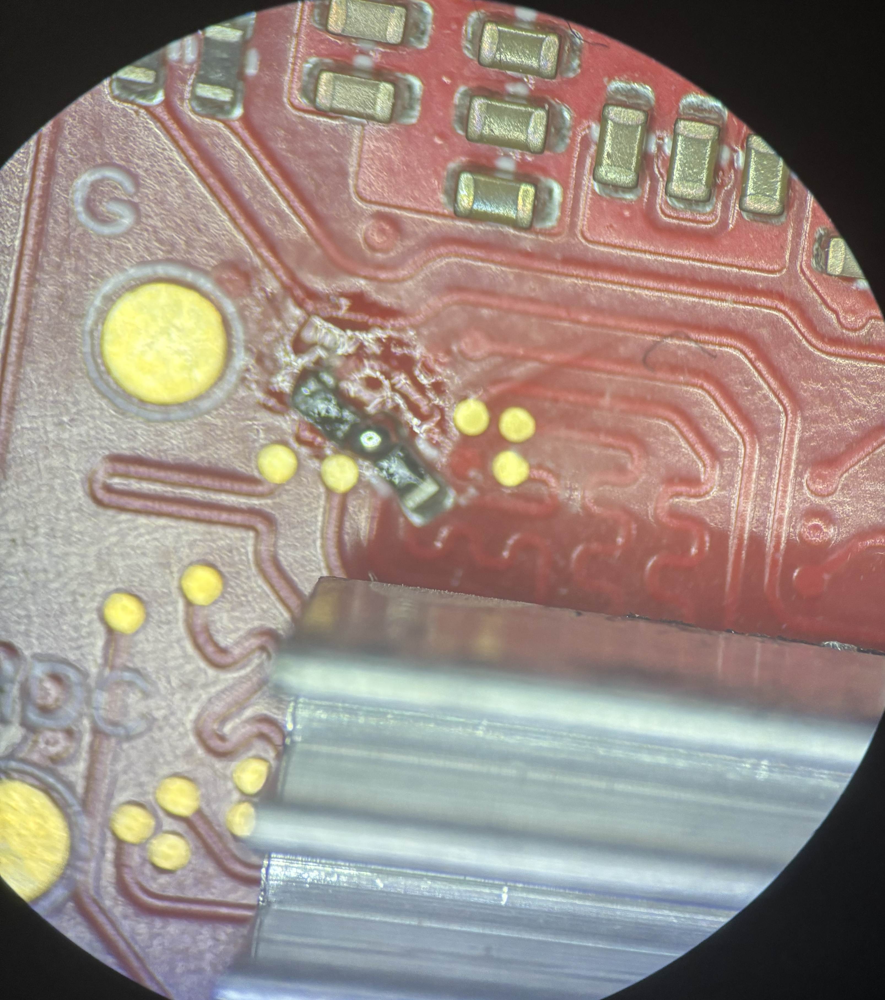

# Switch v4 Errata

## Contents

- [1 Switch v4](#1-switch-v4)
    - [1.1 Primary MCU RMII lanes swapped](#11-primary-mcu-rmii-lanes-swapped)
    - [1.2 88Q2112 Incorrect strapping resistors](#12-88q2112-incorrect-strapping-resistors)

## Key

- A = limitation present, workaround available
- N = limitation present, no workaround available
- P = limitation present, partial workaround available
- "-" = limitation absent

## 1 Switch v4

| **Bug**                                                                            | **4.0.0** | **4.1.0** |
|------------------------------------------------------------------------------------|-----------|-----------|
| [Primary MCU RMII lanes swapped](#11-primary-mcu-rmii-lanes-swapped)               | A         | -         |
| [88Q2112 Incorrect strapping resistors](#12-88q2112-incorrect-strapping-resistors) | A         | -         |

### 1.1 Primary MCU RMII lanes swapped

The primary MCU's RMII TX and RX lanes were accidentally swapped meaning no data could be transmitted or received. This can be fixed by cutting the traces and resoldering them as shown below:

### 1.2 88Q2112 Incorrect strapping resistors

The 88Q2112 PHYs are missing strapping resistors to put them into RGMII mode and so by default they are in SGMII mode. This can be fixed by adding 4.7k ohm resistores between the PHY's RXC pin and GND. This can be done using the untented vias as shown below:

